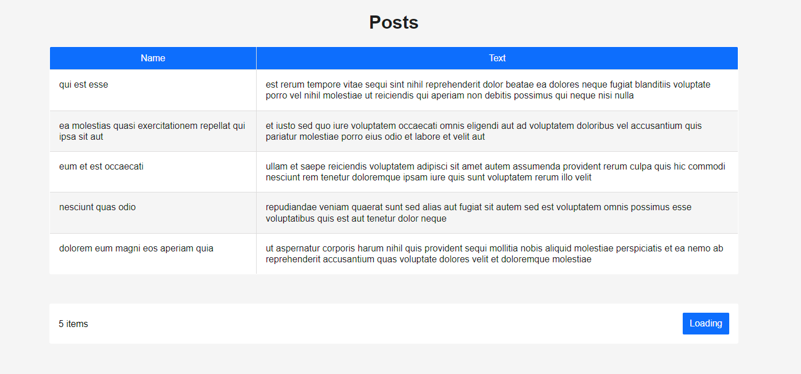

# Posts loading

Simple app for downloading posts. Giper.fm internship test assignment 



---

## Tech Stack

- **Language:** Typescript
- **Request:** fetch

---

## Get start

Clone repository

```console
  git clone git@github.com:ilrosch/giperfm-case-posts.git
  # or
  # git clone https://github.com/ilrosch/giperfm-case-posts.git
```

Install dependencies

```console
  npm ci
```

Run application development

```console
  npm run dev
```

Build application

```console
  npm run build
```
