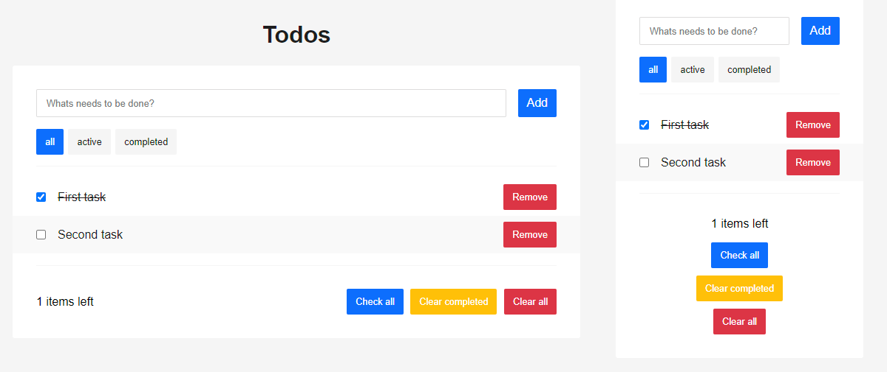

# Todos application

Just an app that allows you to manage your current to-do list. Mindbox internship test assignment 



**Interface:**
- Field for entering a new task
- Task lists: total / uncompleted tasks / completed tasks
- Remove task
- Number of left tasks
- Mark all tasks as completed
- Clear: completed / all tasks

---

## Tech Stack

**Language:** Typescript
**Framework:** React
**State application:** Redux, Redux Toolkit
**Testing:** Jest, React Testing Library

---

## Get start

Clone repository

```console
  git clone git@github.com:ilrosch/mindbox-case-todos.git
  # or
  # git clone https://github.com/ilrosch/mindbox-case-todos.git
```

Install dependencies

```console
  npm ci
```

Run application (open http://localhost:3000 to view it in the browser)

```console
  npm run start
```

Build application

```console
  npm run build
```

Run test

```console
  npm run test
  # npm run test-coverage
```

Run linter

```console
  npm run lint
  # npm run lint-fix
```